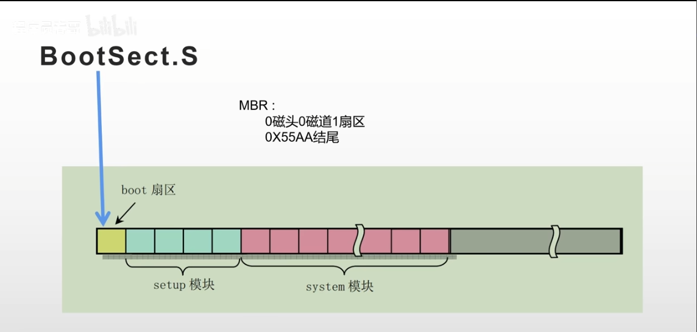

本文解析bootsect.s程序。


即从硬盘启动扇区的512字节中复制数据到内存中0x7c00位置，并跳转到该位置执行，

# start

对应代码

```
SYSSIZE = 0x3000

.globl begtext, begdata, begbss, endtext, enddata, endbss
.text
begtext:
.data
begdata:
.bss
begbss:
.text

SETUPLEN = 4					| nr of setup-sectors
BOOTSEG  = 0x07c0               | original address of boot-sector 
INITSEG  = 0x9000               | we more boot here - out of the way
SETUPSEG = 0x9020				! setup starts here
SYSSEG   = 0x1000               | system loaded at 0x10000(65536)
ENDSEG   = SYSSEG + SYSSIZE		! where to stop loading

! ROOT_DEV:	0x000 - same type of floppy as boot.
! 0x301 - first partition on first drive etc
ROOT_DEV = 0x306
```

从硬盘中第0个扇道0个磁头0磁道的1扇区复制BOOTSEG


```
entry start
	start:
		mov ax, #BOOTSEG
		mov ds, ax
		mov ax, #INITSEG
		mov es, ax
		mov cx, #256
		sub si, si
		sub di, di
		rep
		movw
		jmpi    go, INITSEG
	go: mov ax, cs
		mov ds, ax
		mov es, ax
		mov ss, ax
		mov sp, #0xFF00

```
下面开始逐步分析

```
entry start
	start:
		mov ax, #BOOTSEG
		mov ds, ax
		mov ax, #INITSEG
		mov es, ax
		mov cx, #256
		sub si, si
		sub di, di
```

开始执行start部分代码，本段第一次开始执行过程中，寄存器取值变化如图所示


```
	rep
	movw
```

**rep**:表示重复执行指令**movw**,执行次数由cx寄存器中的值决定，即256次

原理详解：rep通过cx寄存器中自减到0x0000或自加到0xffffH,因而可以执行相应次数的操作

**movw**: 表示复制一个字(Word 16位)，即每次复制两个字节，从ds:si复制到es:di处；


本段函数表示，将内存地址0x7c00处开始的512个字节(256*2)的数据，原封不动复制到0x90000处。


```
	jmpi    go, INITSEG
```

jmpi 是一个段间跳转指令，表示跳转到 0x9000:go 处执行
**jmpi**: 表示跳转到INITSEG(0x9000)为基址，go(此处假定地址为0x0008)为变址的地址继续运行
原理详解：jmpi IP:CS,其中 CS 和 IP是 内存寻址的两个坐标，通过计算CS左移4位+IP确定内存地址。文中通过jmpi go,0x9000,CS被改为0x9000,IP被改为go的地址。本回就是拷贝运行中的系统程序（512字节（1个扇区大小））到另一个内存区域，然后继续从前面执行的位置处执行启动代码


```
go: mov ax, cs
	mov ds, ax
	mov es, ax
	mov ss, ax
	mov sp, #0xFF00
```


**ds**:数据段寄存器

**es**:扩展段寄存器

**ss**:栈段寄存器，后面要配合栈基址寄存器 sp 来表示此时的栈顶地址。而此时 sp 寄存器被赋值为了 0xff00 了，所以目前的栈顶地址就是 ss:sp 所指向的地址 0x9ff00 处。


第一，代码从硬盘移到内存，又从内存挪了个地方，放在了 0x90000 处。
 
第二，数据段寄存器 ds 和代码段寄存器 cs 此时都被设置为了 0x9000，也就为跳转代码和访问内存数据，奠定了同一个内存的基址地址，方便了跳转和内存访问，因为仅仅需要指定偏移地址即可了。
 
第三，栈顶地址被设置为了 0x9ff00，具体表现为栈段寄存器 ss 为 0x9000，栈基址寄存器 sp 为 0xff00。栈是向下发展的，这个栈顶地址 0x9ff00 要远远大于此时代码所在的位置 0x90000，所以栈向下发展就很难撞见代码所在的位置，也就比较安全。这也是为什么给栈顶地址设置为这个值的原因，其实只需要离代码的位置远远的即可。
 
做好这些基础工作后，接下来就又该折腾了其他事了。

总结拔高一下，这一部分其实就是把代码段寄存器 cs，数据段寄存器 ds，栈段寄存器 ss 和栈基址寄存器 sp 分别设置好了值，方便后续使用。

再拔高一下，其实操作系统在做的事情，就是给如何访问代码，如何访问数据，如何访问栈进行了一下内存的初步规划。其中访问代码和访问数据的规划方式就是设置了一个基址而已，访问栈就是把栈顶指针指向了一个远离代码位置的地方而已。


# load_steup

```
load_setup:
	mov	dx,#0x0000			! drive 0, head 0
	mov	cx,#0x0002			! sector 2, track 0
	mov	bx,#0x0200			! address = 512, in INITSEG
	mov	ax,#0x0200+SETUPLEN	! service 2, nr of sectors
	int	0x13				! read it   ! ======================== step 3 =======================     
	jnc	ok_load_setup		! ok - continue
	mov	dx,#0x0000
	mov	ax,#0x0000			! reset the diskette
	int	0x13
	j	load_setup

ok_load_setup:
	mov	dl,#0x00
	mov	ax,#0x0800			! AH=8 is get drive parameters
	int	0x13
	mov	ch,#0x00
	seg cs
	mov	sectors,cx
	mov	ax,#INITSEG
	mov	es,ax

	mov	ah,#0x03			! read cursor pos
	xor	bh,bh
	int	0x10
	
	mov	cx,#24
	mov	bx,#0x0007			! page 0, attribute 7 (normal)
	mov	bp,#msg1
	mov	ax,#0x1301			! write string, move cursor
	int	0x10
	
	mov	ax,#SYSSEG
	mov	es,ax				! segment of 0x010000
	call	read_it        	! ======================== step 4 ======================= 
	call	kill_motor

	seg cs
	mov	ax,root_dev
	cmp	ax,#0
	jne	root_defined
	seg cs
	mov	bx,sectors
	mov	ax,#0x0208			! /dev/ps0 - 1.2Mb
	cmp	bx,#15
	je	root_defined
	mov	ax,#0x021c			! /dev/PS0 - 1.44Mb
	cmp	bx,#18
	je	root_defined
undef_root:
	jmp undef_root
root_defined:
	seg cs
	mov	root_dev,ax
	jmpi	0,SETUPSEG

sread:	.word 1+SETUPLEN	! sectors read of current track
head:	.word 0				! current head
track:	.word 0				! current track

read_it:
	mov ax,es
	test ax,#0x0fff
die:	
	jne die					! es must be at 64kB boundary
	xor bx,bx				! bx is starting address within segment
rp_read:
	mov ax,es
	cmp ax,#ENDSEG			! have we loaded all yet?
	jb ok1_read
	ret
ok1_read:
	seg cs
	mov ax,sectors
	sub ax,sread
	mov cx,ax
	shl cx,#9
	add cx,bx
	jnc ok2_read
	je  ok2_read
	xor ax,ax
	sub ax,bx
	shr ax,#9
ok2_read:
	call read_track
	mov cx,ax
	add ax,sread
	seg cs
	cmp ax,sectors
	jne ok3_read
	mov ax,#1
	sub ax,head
	jne ok4_read
	inc track
ok4_read:
	mov head,ax
	xor ax,ax
ok3_read:
	mov sread,ax
	shl cx,#9
	add bx,cx
	jnc rp_read
	mov ax,es
	add ax,#0x1000
	mov es,ax
	xor bx,bx
	jmp rp_read

read_track:
	push ax
	push bx
	push cx
	push dx
	mov dx,track
	mov cx,sread
	inc cx
	mov ch,dl
	mov dx,head
	mov dh,dl
	mov dl,#0
	and dx,#0x0100
	mov ah,#2
	int 0x13
	jc bad_rt
	pop dx
	pop cx
	pop bx
	pop ax
	ret
bad_rt:	mov ax,#0
	mov dx,#0
	int 0x13
	pop dx
	pop cx
	pop bx
	pop ax
	jmp read_track

kill_motor:
	push dx
	mov dx,#0x3f2
	mov al,#0
	outb
	pop dx
	ret

sectors:
	.word 0

msg1:
	.byte 13,10
	.ascii "Loading system ..."
	.byte 13,10,13,10

.org 508
root_dev:
	.word ROOT_DEV
boot_flag:
	.word 0xAA55

.text
endtext:
.data
enddata:
.bss
endbss:
```

从int 13开始逐步分析

```
		mov	dx,#0x0000			! drive 0, head 0
		mov	cx,#0x0002			! sector 2, track 0
		mov	bx,#0x0200			! address = 512, in INITSEG
		mov	ax,#0x0200+SETUPLEN	! service 2, nr of sectors
		int	0x13				! read it      
		jnc	ok_load_setup		! ok - continue
```

int 0x13 表示发起 0x13 号中断，这条指令上面给 dx、cx、bx、ax 赋值都是作为这个中断程序的参数。中断发起后，CPU 会通过这个中断号，去寻找对应的中断处理程序的入口地址，并跳转过去执行，逻辑上就相当于执行了一个函数。而 0x13 号中断的处理程序是 BIOS 提前给我们写好的，是读取磁盘的相关功能的函数。


之后真正进入操作系统内核后，中断处理程序是需要我们自己去重新写的，这个在后面的章节中，你会不断看到各个模块注册自己相关的中断处理程序，所以不要急。此时为了方便就先用 BIOS 提前给我们写好的程序了。

本段代码的注释已经写的很明确了，直接说最终的作用吧，就是将硬盘的第 2 个扇区开始，把数据加载到内存 0x90200 处，共加载 4 个扇区，图示其实就是这样。


可以看到，如果从对应扇区读取文件成功，就跳转到 ok_load_setup 这个标签，如果失败，则会不断重复执行这段代码，也就是重试。那我们就别管重试逻辑了，直接看成功后跳转的 ok_load_setup 这个标签后的代码

```
	mov	dl,#0x00
	mov	ax,#0x0800			! AH=8 is get drive parameters
	int	0x13
	mov	ch,#0x00
	seg cs
	mov	sectors,cx
	mov	ax,#INITSEG
	mov	es,ax

	mov	ah,#0x03			! read cursor pos
	xor	bh,bh
	int	0x10
	
	mov	cx,#24
	mov	bx,#0x0007			! page 0, attribute 7 (normal)
	mov	bp,#msg1
	mov	ax,#0x1301			! write string, move cursor
	int	0x10

	mov	ax,#SYSSEG
	mov	es,ax				! segment of 0x010000
	call	read_it        	! ======================== step 4 ======================= 
	call	kill_motor

	seg cs
	mov	ax,root_dev
	cmp	ax,#0
	jne	root_defined
	seg cs
	mov	bx,sectors
	mov	ax,#0x0208			! /dev/ps0 - 1.2Mb
	cmp	bx,#15
	je	root_defined
	mov	ax,#0x021c			! /dev/PS0 - 1.44Mb
	cmp	bx,#18
	je	root_defined
undef_root:
	jmp undef_root
root_defined:
	seg cs
	mov	root_dev,ax
	jmpi	0,SETUPSEG
```

从中抽取主逻辑代码如下，这段代码省略了很多非主逻辑的代码，比如在屏幕上输出 Loading system ... 这个字符串以防止用户等烦了。
```
ok_load_setup:
    ...
    mov ax,#INITSEG
    mov es,ax; 
	...
    call read_it
    ...
    jmpi 0,0x9020

read_it:
	mov ax,es
	test ax,#0x0fff
read_it:
	mov ax,es
	test ax,#0x0fff
	...
```
其作用是把从硬盘第 6 个扇区开始往后的 240 个扇区，加载到内存 0x10000 处，和之前的从硬盘捣腾到内存是一个道理。


至此，整个操作系统的全部代码，就已经全部从硬盘中，被搬迁到内存来了。


```
	mov	dl,#0x00
	mov	ax,#0x0800			! AH=8 is get drive parameters
	int	0x13
```
	本段代码作用为读取当前设备尺寸信息，并存储在内存中。
原理详解:
int 0x13函数是汇编语言中提供了获取磁盘设备信息的中断号。
AH=0x02 - Read Sectors From Drive

AH=0x03 - Write Sectors To Drive

AH=0x08 - Get Drive Parameters

输出结果中，分别表示：

AH: BIOS disk function number

AL: Number of sectors to transfer (1-128)

CH: Low byte of cylinder number (0-1023)

CL: High byte of the sector number (1-63), and low 6 bits are the sector number

DH: Head number (0-15)

DL: Drive number (for floppy disk system: 0=A: no drive, 1=A:, 80h to 81h=fixed disk; for hard disk only first four bits are used)

	硬盘的DOS(Disk Operatiing System)管理结构：

	硬盘的最基本的组成是有金属材料制成的涂以磁性介质的盘面，不同容量的磁盘的盘面数不同，每个盘面有正反两面，都可以记录信息。

	盘片被分成许多扇形的区域，每个区域叫做一个扇区（sector），每个扇区可存储128x2的N次方的字节信息。在DOS中每个扇区是128x2的2次方=512个字节(sector size)。

	盘片表面以片面的中心为圆心，不同半径的同心圆称作磁道。

	不同盘面的相同半径的磁道所组成的圆柱称为柱面（cylinder）。

	每个磁盘有两面，每面都有一个磁头（head)。

	因此磁盘的存储容量的计算公式：磁头数（heads，说明有多少个盘面) * 柱面（cylinders，说明有每个盘面多少个磁道） * 每道扇区数（sectors) * 每个扇区字节数（sector size)


```
	mov	ch,#0x00
	seg cs
	mov	sectors,cx

sectors:
	.word 0
```

sectors是个标量指向一个word长的地址。seg cs表明了sectors的段地址是cs(0x9000)，而不是ds。而且seg cs 的作用范围只有下一行，不会延伸到其他地方。所以此处为


```
	mov	ax,#INITSEG
	mov	es,ax

	mov	ah,#0x03			! read cursor pos
	xor	bh,bh				！异或，将bx高位清零
	int	0x10
```

通过中断号int 0x10获取光标位置并将其存储在dh,dl中。

原理详解：

0x10函数常用参数：
AH: function code

AL: character/ color code

BH: display page - page number

BL: foreground color

CX: number of times operation needs to be performed

DH: row position of cursor

DL: column position of cursor

ES: segment of memory where data is stored.

```
	mov	cx,#24
	mov	bx,#0x0007			! page 0, attribute 7 (normal)
	mov	bp,#msg1
	mov	ax,#0x1301			! write string, move cursor
	int	0x10

msg1:
	.byte 13,10
	.ascii "Loading system ..."
	.byte 13,10,13,10
```
将msg1中消息通过基址寄存器bp打在屏幕上，并移动光标，提示用户载入系统中。


```
call	kill_motor

kill_motor:
	push dx
	mov dx,#0x3f2
	mov al,#0
	outb
	pop dx
	ret
```

先将dx中保存的光标行号与列号入栈，然后通过dx中存储的端口0x3f2发送al中的消息0，关闭软驱，之后出栈数据，使得dx中继续保存为光标的行号与列号，将控制权返回主控。

```
	mov	ax,#SYSSEG
	mov	es,ax				! segment of 0x010000
	call	read_it        	! ======================== step 4 ======================= 
	call	kill_motor
	seg cs
	mov	ax,root_dev
	cmp	ax,#0
	jne	root_defined
	seg cs
	mov	bx,sectors
	mov	ax,#0x0208			! /dev/ps0 - 1.2Mb
	cmp	bx,#15
	je	root_defined
	mov	ax,#0x021c			! /dev/PS0 - 1.44Mb
	cmp	bx,#18
	je	root_defined
undef_root:
	jmp undef_root
root_defined:
	seg cs
	mov	root_dev,ax
	jmpi	0,SETUPSEG

root_dev:
	.word ROOT_DEV
```
加载系统后，获取根设备的参数,Linux 0.11使用Minix操作系统的文件系统管理方式，要求系统必须存在一个根文件系统，其他文件系统挂接其上，而不是同等地位。


Linux 0.11没有提供在设备上建立文件系统的工具，故必须在一个正在运行的系统上利用工具（类似FDISK和Format）做出一个文件系统并加载至本机。因此Linux 0.11的启动需要两部分数据，即系统内核镜像和根文件系统。注意：这里的文件系统指的不是操作系统内核中的文件系统代码，而是有配套的文件系统格式的设备，如一张格式化好的软盘。因为本书假设所用的计算机安装了一个软盘驱动器、一个硬盘驱动器，在内存中开辟了2 MB的空间作为虚拟盘（见第2章的main函数），并在BIOS中设置软盘驱动器为启动盘，所以，经过一系列检测，确认计算机中实际安装的软盘驱动器为根设备，并将信息写入机器系统数据。

然后又通过一个熟悉的段间跳转指令 jmpi 0,0x9020，跳转到 0x90200 处，就是硬盘第二个扇区开始处的内容。


```
boot_flag:
	.word 0xAA55
```
操作系统最后结尾为0xAA55。

那这里的内容是什么呢？先不急，我们借这个机会把整个操作系统的编译过程说下。整个编译过程，就是通过 Makefile 和 build.c 配合完成的，最终会：

1. 把 bootsect.s 编译成 bootsect 放在硬盘的 1 扇区。
2. 把 setup.s 编译成 setup 放在硬盘的 2~5 扇区。
3. 把剩下的全部代码（head.s 作为开头）编译成 system 放在硬盘的随后 240 个扇区。
   
所以整个路径就是这样的。


所以，我们即将跳转到的内存中的 0x90200 处的代码，就是从硬盘第二个扇区开始处加载到内存的。第二个扇区的最开始处，那也就是 setup.s 文件的第一行代码咯。
